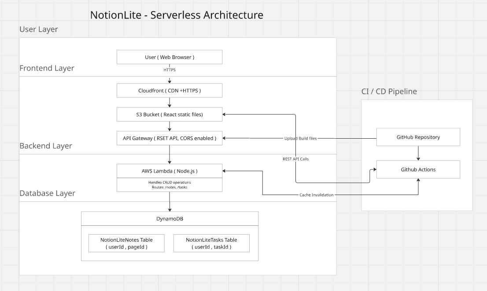

# Notion Lite – Full Stack Serverless Notes & Tasks App

A Notion-inspired full‑stack web application built using **React** and **AWS Serverless architecture** (Lambda, API Gateway, DynamoDB) with **CI/CD deployment to S3 + CloudFront using GitHub Actions**.

This README serves as a **complete technical guide** to understand, run, deploy, and reproduce the project from scratch.

---

## Table of Contents

1. Project Overview
2. Features
3. Tech Stack
4. Architecture
5. Project Structure
6. Local Setup (Frontend)
7. AWS Backend Setup
8. Database Setup (DynamoDB)
9. API Gateway Setup
10. Frontend ↔ Backend Integration
11. CI/CD Setup (GitHub Actions)
12. Production Deployment
13. Common Issues & Debugging
14. Cost Management
15. Project Links

---

## 1. Project Overview

Notion Lite is a cloud‑based productivity web application that allows users to:

* Create, edit, and delete notes
* Manage daily tasks
* Store all data persistently in AWS DynamoDB
* Access the app securely via CloudFront CDN
* Automatically deploy updates using CI/CD

---

## 2. Features

* Notes editor
* Daily tasks management
* Persistent cloud storage
* Serverless REST APIs
* Global CDN delivery
* HTTPS enabled
* Automated deployments

---

## 3. Tech Stack

**Frontend:** React.js, JavaScript, HTML, CSS
**Backend:** AWS Lambda (Node.js), API Gateway
**Database:** DynamoDB (Composite keys)
**DevOps:** GitHub Actions, S3, CloudFront

---

## 4. Architecture

```


```

---

## 5. Project Structure

```
src/
 ├── api/            # API clients
 ├── components/     # UI components
 ├── pages/          # Home, Tasks
 ├── styles/         # CSS
 ├── config.js       # API base URL
 └── index.js

.github/workflows/
 └── deploy.yml      # CI/CD pipeline
```

---

## 6. Local Setup (Frontend)

### Prerequisites

* Node.js 18+
* Git

### Steps

```bash
git clone https://github.com/PranavNarain/notion-lite.git
cd notion-lite
npm install
npm start
```

App runs at:

```
http://localhost:3000
```

---

## 7. AWS Backend Setup

### Create Lambda Function

* Runtime: Node.js 18
* Create file: `index.mjs`
* Enable CORS responses

Lambda responsibilities:

* Handle /notes and /tasks routes
* Perform CRUD operations on DynamoDB

---

## 8. DynamoDB Setup

Create two tables:

### NotionLiteNotes

| Key         | Type   |
| ----------- | ------ |
| userId (PK) | String |
| pageId (SK) | String |

### NotionLiteTasks

| Key         | Type   |
| ----------- | ------ |
| userId (PK) | String |
| taskId (SK) | String |

---

## 9. API Gateway Setup

Create REST API with routes:

### Notes

* GET /notes
* POST /notes
* DELETE /notes

### Tasks

* GET /tasks
* POST /tasks
* DELETE /tasks

Enable:

* Lambda proxy integration
* CORS for all routes

Deploy stage: `dev`

---

## 10. Frontend ↔ Backend Integration

Set API URL in:

```
src/config.js
```

```js
export const API_BASE_URL = "https://<api-id>.execute-api.<region>.amazonaws.com/dev";
```

Use fetch API in:

* src/api/notes.js
* src/api/tasks.js

---

## 11. CI/CD Setup (GitHub Actions)

### Workflow File

```
.github/workflows/deploy.yml
```

Pipeline steps:

1. Install dependencies
2. Build React app
3. Upload to S3
4. Invalidate CloudFront cache

### Required GitHub Secrets

* AWS_ACCESS_KEY_ID
* AWS_SECRET_ACCESS_KEY
* AWS_REGION
* S3_BUCKET
* CLOUDFRONT_ID

---

## 12. Production Deployment

### Create S3 bucket

* Enable static website hosting
* Allow public access

### Create CloudFront distribution

* Origin: S3 bucket
* Default root object: index.html

### Trigger deployment

```bash
git push origin main
```

App will be live at CloudFront domain.

---

## 13. Common Issues & Debugging

| Problem            | Cause              | Fix                   |
| ------------------ | ------------------ | --------------------- |
| Notes disappear    | Backend not saving | Check Lambda logs     |
| Delete not working | Wrong DynamoDB key | Use composite keys    |
| CI build fails     | ESLint warnings    | Fix warnings          |
| Old version shown  | Cache issue        | Invalidate CloudFront |

---

## 14. Cost Management

Recommended after learning:

* Delete CloudFront distribution
* Delete S3 bucket
* Delete Lambda
* Delete API Gateway
* Delete DynamoDB tables
* Delete IAM user

Set AWS billing alarm at $1.

---

## 15. Project Links

* GitHub Repository: [https://github.com/PranavNarain/notion-lite](https://github.com/PranavNarain/notion-lite)
* GitHub Profile: [https://github.com/PranavNarain](https://github.com/PranavNarain)

---

## Author

Pranav Narain
Full Stack & Cloud Developer

---

*End of README*
